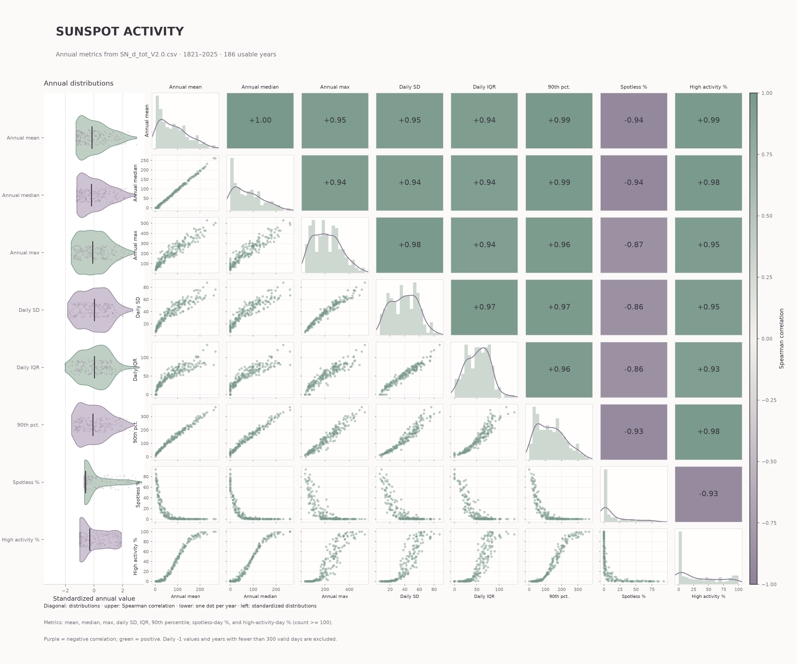
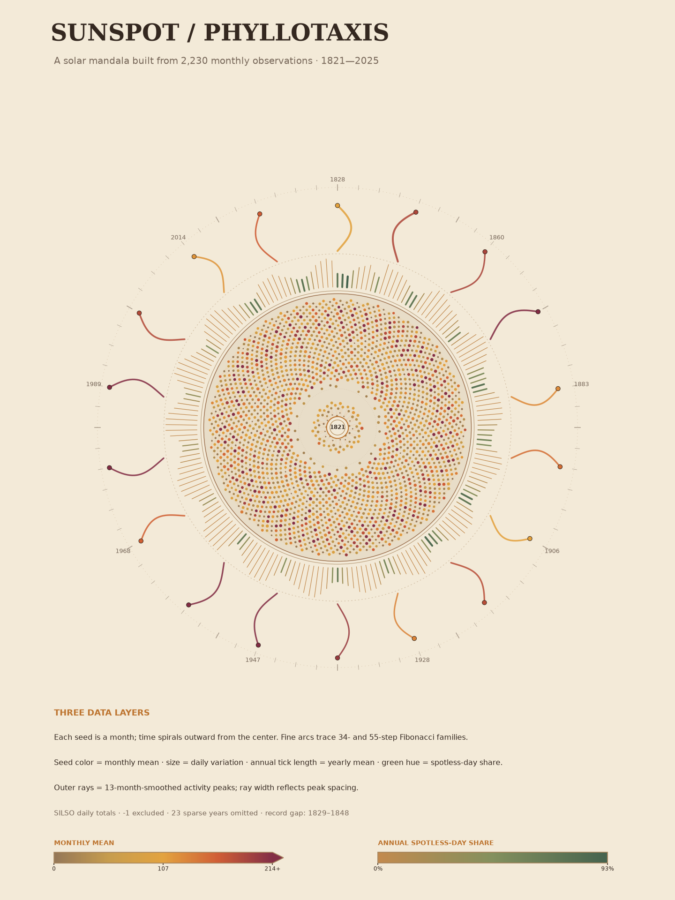

# The phenomenon
Sunspot activity, rising and falling in an approximate 11-year solar cycle, dictates the magnetic rhythm of our star and its space weather impact on Earth.

[Open the interactive sunspot visualization](https://miajiao5.github.io/Asignment-2-Sunspot/)

## The phenomenon
Sunspots are magnetic activities occurring on the photosphere of the Sun, with their quantity and activity levels exhibiting a periodic rise and fall (approximately every 11 years for a complete solar cycle). 

I chose to observe and analyze this phenomenon because it connects macro-level cosmic rhythms with Earth's electromagnetic environment. By analyzing long-term astronomical observation data spanning two centuries, we can intuitively explore the periodic, chaotic beauty of the natural world and how it cyclically influences Earth's magnetic field, auroras, and radio communications.

## The source
The data is obtained from the official daily sunspot data provided by [SIDC/SILSO](https://www.sidc.be/SILSO/datafiles)[cite: 3]. 

The dataset contains 76,214 rows[cite: 3]. Each row represents the daily international sunspot relative number for a specific date from January 1, 1818, to August 31, 2026, where the unit is the dimensionless International Sunspot Number (with missing or invalid observations marked as -1).

## What the picture shows

### Chart 1: Sunspot Relationship Activity

This chart compares eight annual measures of sunspot activity, including the mean, median, maximum, variability, and percentages of spotless and high-activity days. The diagonal shows each measure's distribution, the upper triangle shows pairwise Spearman correlations, the lower triangle plots yearly values, and the violin plot at left compares standardized distributions. Invalid daily readings and years with fewer than 300 valid observations are excluded, so the chart summarizes annual patterns rather than the full daily record.

### Chart 2: Sunspot Phyllotaxis Sunflower

Each seed represents one month arranged in chronological order along a spiral; its color shows the monthly mean sunspot count, and its size shows daily variation. The outer annual ring encodes yearly mean activity through tick length and radial distance, while green color indicates the share of spotless days; the rays mark peaks in the 13-month-smoothed activity record. Invalid daily readings are excluded, months with fewer than 15 valid observations and years with fewer than 300 valid days are omitted, and the 1829–1848 observation gap remains visible in the record.

## Run it
uv run fetch.py

uv run .\plot_sunspots1_activity.py

uv run .\plot_sunspots2_phyllotaxis_sunflower.py

The fetch step downloads the SILSO data only if it is not already present. The first plotting script saves the relationship matrix to `out/`; the second saves the sunflower image to `out/` and generates the interactive page at `site/index.html`.
